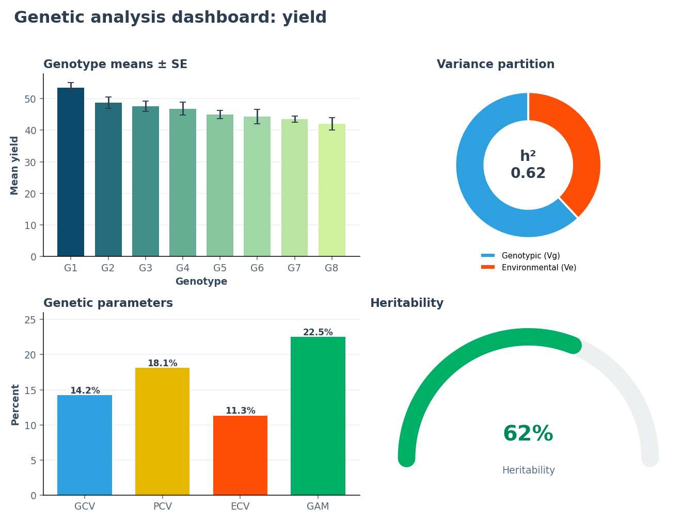
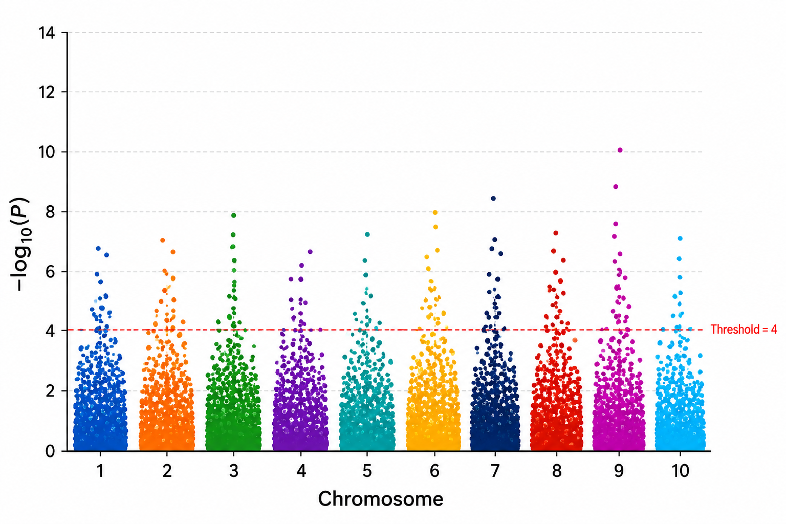
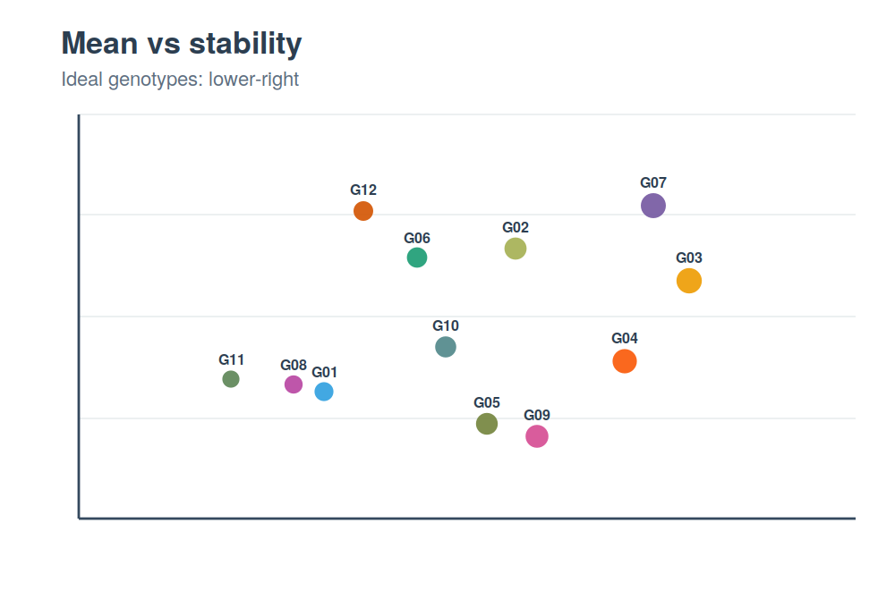
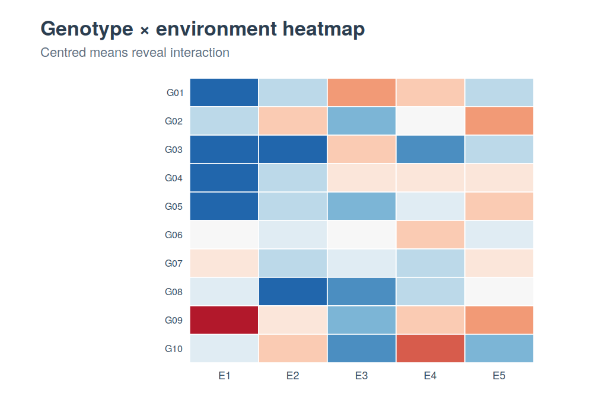
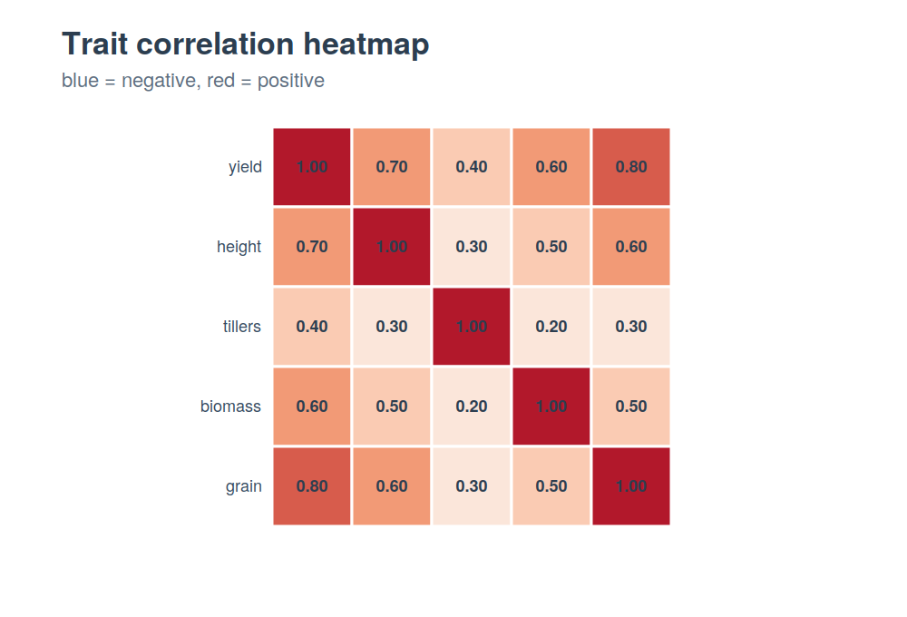
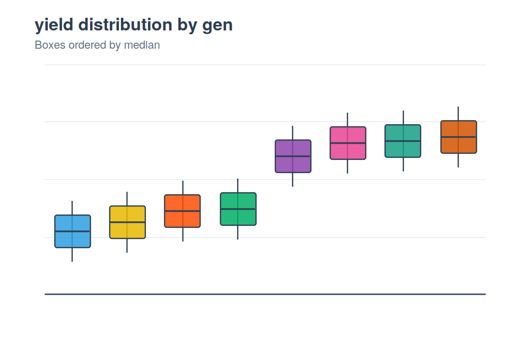

<!-- Hero banner -->
<p align="center">
  
</p>

<p align="center">
  <em>A complete plant-breeding &amp; genomic analysis workbench in R — from a single variety trial to genomic selection, with attractive, publication-ready figures and one-click reports.</em>
</p>

<!-- badges: start -->
<p align="center">
  <a href="https://github.com/parthabehera/PbStatR/actions/workflows/R-CMD-check.yaml"></a>
  <a href="https://app.codecov.io/gh/parthabehera/PbStatR"></a>
  <a href="https://www.gnu.org/licenses/gpl-3.0"></a>
  <a href="https://lifecycle.r-lib.org/"></a>
  
</p>
<!-- badges: end -->

<p align="center">
  <a href="#-quick-start">Quick start</a> ·
  <a href="#-what-can-it-do">Features</a> ·
  <a href="#-gallery">Gallery</a> ·
  <a href="#-learn">Tutorials</a> ·
  <a href="#-installation">Install</a>
</p>

---

## ⚡ 60-second demo

From raw data to a full genetic analysis in **four commands**:

```r
library(PbStatR)

trial <- pb_data("met")                    # a bundled example trial
rcbd  <- subset(trial, env == "E1")

pb_explore("heritability")                 # 1. which function do I need?
res <- pb_analyze(rcbd, "yield", "gen", "rep")   # 2. run the whole analysis
pb_genetic_dashboard(rcbd, "yield", "gen", "rep") # 3. one attractive summary figure
pb_report(rcbd, "yield", "gen", "rep")     # 4. export an HTML/Word report
```

That's it — ANOVA, heritability, genetic parameters, mean grouping, plots, and a
shareable document, without wrangling a single formula.

---

## ✨ Why PbStatR?

|  |  |
|---|---|
| 🎯 **One call to insight** | `pb_analyze()` runs the whole trial analysis and explains it in plain language; `pb_report()` turns it into a report. |
| 🌈 **Beautiful by default** | Every plot uses a shared, colour-blind-friendly theme and palette — boxplots, heatmaps, Manhattan and stability charts all match. |
| 🌾 **Field to genome** | Designs, quantitative genetics, G×E stability, biometrics, GWAS, genomic selection, machine learning, Bayesian analysis, and breeding simulation — all in one place. |
| 🎓 **Student-friendly** | `pb_explore()`, `pb_workflow()`, `pb_guide()` and `pb_explain()` guide you to the right tool and explain the concepts. |
| 📦 **Runs out of the box** | Bundled example datasets so every function works immediately — no data hunting. |

---

## 🖼 Gallery

<table>
  <tr>
    <td align="center"><br/><sub><b>Genetic dashboard</b> — one-figure summary</sub></td>
    <td align="center"><br/><sub><b>Manhattan</b> — GWAS with clear thresholds</sub></td>
  </tr>
  <tr>
    <td align="center"><br/><sub><b>Mean vs stability</b> — ideal-genotype quadrant</sub></td>
    <td align="center"><br/><sub><b>G×E heatmap</b> — interaction at a glance</sub></td>
  </tr>
  <tr>
    <td align="center"><br/><sub><b>Correlation heatmap</b></sub></td>
    <td align="center"><br/><sub><b>Boxplots</b> across environments</sub></td>
  </tr>
</table>

<sub>Illustrative thumbnails. Regenerate from live output with <code>Rscript data-raw/make_figures.R</code>.</sub>

---

## 🧰 What can it do?

<details open>
<summary><b>Start here (student-friendly)</b></summary>

`pb_explore()` · `pb_workflow()` · `pb_analyze()` · `pb_genetic_dashboard()` · `pb_report()` · `pb_summary()` · `pb_guide()` · `pb_explain()` · `pb_help()`
</details>

<details>
<summary><b>Quantitative genetics</b></summary>

`pb_genetic_params()` (GCV, PCV, ECV, h², GA, GAM) · `pb_varcomp()` · `pb_heritability()` · `pb_genetic_advance()` · `pb_breeders_eqn()` · `pb_realized_h2()` · `pb_selection_intensity()` · `pb_plot_selection()`
</details>

<details>
<summary><b>ANOVA &amp; field designs</b></summary>

`pb_aov_design()` (CRD, RCBD, LSD, factorial, split-plot, split-split, strip-plot) with diagnostics · `pb_posthoc()` (Tukey, Duncan, LSD, SNK, Scheffé) · `design_*()` &amp; `field_*()` layouts with maps (agricolae + FielDHub) · augmented designs
</details>

<details>
<summary><b>Multi-environment &amp; stability</b></summary>

`pb_gxe()` (joint ANOVA, Finlay-Wilkinson, Shukla, ecovalence) · `pb_ammi()` · `pb_waasb()` · `pb_gge()` · `pb_stability_ranks()` &amp; `pb_plot_stability()` · `pb_gxe_heatmap()`
</details>

<details>
<summary><b>Multi-trait selection (metan)</b></summary>

`pb_mgidi()` · `pb_mtsi()` · `pb_fai_blup()` · `pb_smith_hazel()` · plots: `pb_radar_plot()`, `pb_venn_plot()`, `pb_waasb_xy_plot()`, `pb_waasby_plot()`, `pb_blup_plot()`
</details>

<details>
<summary><b>Biometrics</b></summary>

`pb_line_tester()` · `pb_diallel()` · `pb_griffing()` · `pb_generation_mean()`
</details>

<details>
<summary><b>Genomics &amp; prediction</b></summary>

`pb_blup()` · `pb_grm()` · `pb_gblup()` (+ cross-validation) · `pb_ml_predict()` / `pb_ml_compare()` (RF, XGBoost, SVR, elastic net) · GWAS via `pb_gwas_rmvp()` / `pb_gwas_gapit()` · `pb_manhattan()` · `pb_qqplot()` · QTL, molecular diversity, envirotyping
</details>

<details>
<summary><b>Bayesian &amp; simulation</b></summary>

`pb_bayes_met()` → `pb_bayes_prob()` (probability of superiority, ProbBreed) · `pb_bayes_prob_bars()` · breeding simulation via `pb_sim_founders()` / `pb_sim_pipeline()` (AlphaSimR)
</details>

---

## 📊 Multi-trait, multi-environment made simple

```r
# genotype × environment stability, every method at once
pb_gxe(trial, gen = "gen", env = "env", rep = "rep", trait = "yield")

ranks <- pb_stability_ranks(trial, "gen", "env", "rep", "yield")
pb_plot_stability(ranks)          # ideal genotypes in the green quadrant

# multi-trait genomic selection index
mod <- pb_met(trial, "env", "gen", "rep", "yield")
pb_mgidi(mod)                     # MGIDI ranking + radar plot
```

---

## 🎓 Learn

| Tutorial | For |
|---|---|
| `vignette("PbStatR-tutorial")` | **Complete analysis in five steps** — explore → analyse → visualise → report |
| `vignette("PbStatR-beginners")` | A gentle first look for new R users |
| `vignette("PbStatR-gwas-stability")` | Worked GWAS &amp; stability examples |

Not sure what to run? Just ask the package:

```r
pb_explore("stability")     # find the right function for any goal
pb_explain("heritability")  # plain-language definition
pb_help()                   # the full categorised menu
```

---

## 📥 Installation

```r
# install.packages("devtools")
devtools::install_github("parthabehera/PbStatR")
```

Some advanced features use optional packages (installed only if you need them):
`metan`, `FielDHub`, `rMVP`, `rrBLUP`, `AlphaSimR`, `ProbBreed`, and others.

---

## 🤝 Contributing &amp; citation

Issues and pull requests are welcome. If PbStatR helps your research, please
cite it — run `citation("PbStatR")` for the entry.

## 📄 License

Released under the [GPL-3](https://www.gnu.org/licenses/gpl-3.0) license.

<p align="center"><sub>Built for plant breeders, quantitative geneticists, and the students becoming them. 🌱</sub></p>
