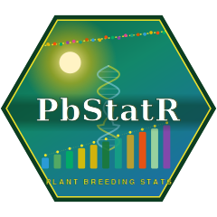

# PbStatR 

<!-- badges: start -->
[](https://github.com/yourusername/PbStatR/actions/workflows/R-CMD-check.yaml)
[](https://www.gnu.org/licenses/gpl-3.0)
<!-- badges: end -->

**PbStatR** is a comprehensive R toolkit for plant breeding and quantitative
genetics — from genetic variability parameters and field-trial statistics all
the way to genomic selection and breeding-scheme simulation.

## Installation

```r
# install.packages("devtools")
devtools::install_github("yourusername/PbStatR")
```

## Feature map

| Module | Functions |
|---|---|
| **Start here (student-friendly)** | `pb_analyze()` — one-call guided trial analysis with plain-language summary & plots; `pb_summary()`; `pb_help()` |
| Genetic variability | `pb_anova()`, `pb_genetic_params()` — ANOVA, GCV, PCV, ECV, heritability, GA, GAM |
| Post-hoc & diagnostics | `pb_posthoc()` (Tukey, Duncan, LSD, SNK, Scheffe, Bonferroni), `pb_assumptions()` (Shapiro, Bartlett, Levene) |
| Associations | `pb_correlation()`, `pb_path_analysis()` |
| Diversity | `pb_diversity()`, `pb_diversity_indices()` (Shannon/Simpson), `pb_molecular_diversity()` |
| Multivariate & figures | `pb_pca()`, `pb_hcpc()` (FactoMineR/factoextra), `pb_heatmap()`, `pb_data_heatmap()` |
| Experimental designs (agricolae) | `design_crd/rcbd/lsd/factorial/split_plot/alpha_lattice/augmented()` |
| Field designs + maps (FielDHub) | `field_crd/rcbd/alpha/augmented()`, `field_map()` — field books with plot maps |
| Multi-environment | `pb_met()`, `pb_selection_index()` |
| Stability | `pb_stability()`, `pb_ammi()`, `pb_waasb()`, `pb_eberhart_russell()` |
| Biometrical genetics | `pb_line_tester()`, `pb_diallel()`, `pb_griffing()`, `pb_generation_mean()` |
| Mixed models & BLUP | `pb_blup()` (lme4), `pb_grm()`, `pb_gblup()` (+ cross-validation), `pb_select()` |
| Molecular / advanced | `pb_gwas()`, `pb_qtl()`, `pb_envirotype()`, `pb_bayesian()` |
| GWAS engines & maps | `pb_gwas_rmvp()` (rMVP: GLM/MLM/FarmCPU), `pb_gwas_gapit()` (GAPIT), `pb_marker_map()`, `pb_manhattan()`, `pb_qqplot()` |
| Comprehensive G×E | `pb_gxe()` (all methods at once), `pb_gxe_anova()`, `pb_gxe_regression()` (Finlay-Wilkinson), `pb_shukla()`, `pb_ecovalence()`, `pb_gge()`, `pb_stability_ranks()` (combined ranking), `pb_plot_stability()` |
| Machine learning | `pb_ml_predict()` (RF, XGBoost, SVR, elastic net), `pb_ml_compare()` (benchmark vs GBLUP) |
| Augmented designs | `pb_augmented()`, `pb_augmented_multi()` (augmentedRCBD) |
| Breeding simulation | `pb_sim_founders()`, `pb_sim_pipeline()`, `pb_plot_gain()` (AlphaSimR) |


## Bundled example data

Every function can be tried immediately on the datasets that ship with the
package — no need to find your own:

```r
met  <- pb_data("met")        # 20 genotypes x 5 environments x 3 reps
geno <- pb_data("geno")       # 200 individuals x 500 SNPs (GWAS-ready)
map  <- pb_data("map")        # marker map: SNP, Chr, Pos
pheno <- pb_data("pheno")     # phenotype with 8 real causal SNPs
aug  <- pb_data("augmented")  # augmented RCBD

pb_data_causal()              # the true causal SNPs, to check GWAS recovery
```

See `vignette("PbStatR-gwas-stability")` for two complete worked analyses.

## Quick start — the one-call analysis

New to R? Start with `pb_analyze()`. It runs the ANOVA, checks assumptions,
estimates heritability, groups the means, and explains everything in plain
language — returning all the plots and tables for later use.

```r
library(PbStatR)

trial <- data.frame(
  variety = rep(paste0("V", 1:6), each = 3),
  block   = rep(1:3, times = 6),
  yield   = rnorm(18, 45, 6)
)

result <- pb_analyze(trial, trait = "yield",
                     genotype = "variety", block = "block")

result$plots$boxplot        # ggplot, ready to print or save
result$means                # ranked means with grouping letters
result$genetic_params       # GCV, PCV, heritability, GAM ...
```

Not sure where to start? Run `pb_help()` for a categorised menu of everything
the package does.

## Genomic selection example

```r
G   <- pb_grm(marker_matrix)                 # VanRaden GRM
gs  <- pb_gblup(y = pheno, M = marker_matrix, cv_folds = 5)
gs$cv_accuracy                                # predictive ability
top <- pb_select(setNames(gs$GEBV, ids), proportion = 0.1)
```

## Breeding pipeline simulation

```r
sim <- pb_sim_founders(n_founders = 100, h2 = 0.3)
run <- pb_sim_pipeline(sim, cycles = 15, method = "genomic")
pb_plot_gain(run)
run$gain_per_cycle
```

## Development pipeline

- `R CMD check` on Ubuntu, macOS and Windows via GitHub Actions.
- Documentation site auto-built with **pkgdown**.
- Unit tests with **testthat** (edition 3).

## License

GPL-3
